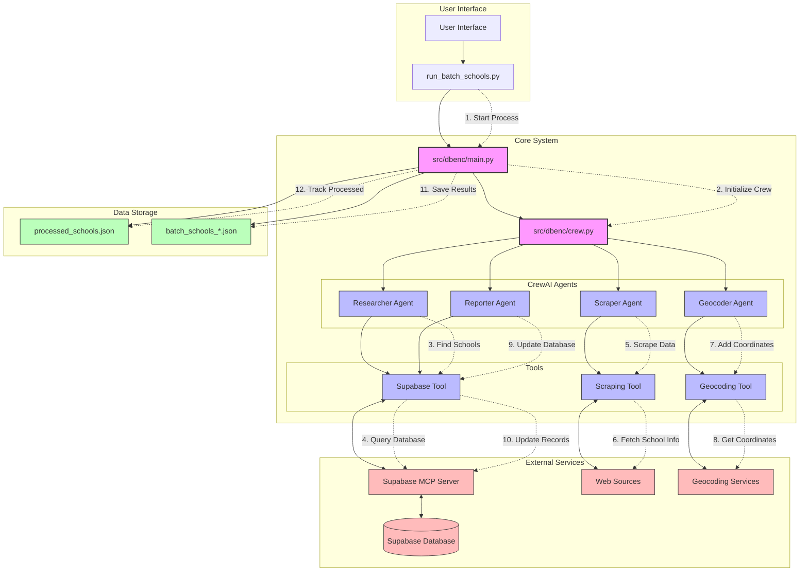

```mermaid
graph TD
    subgraph "User Interface"
        UI[User Interface]
        RunBatch[run_batch_schools.py]
    end

    subgraph "Core System"
        Main[src/dbenc/main.py]
        Crew[src/dbenc/crew.py]
        
        subgraph "CrewAI Agents"
            Researcher[Researcher Agent]
            Scraper[Scraper Agent]
            Geocoder[Geocoder Agent]
            Reporter[Reporter Agent]
        end
        
        subgraph "Tools"
            SupabaseTool[Supabase Tool]
            ScrapingTool[Scraping Tool]
            GeocodingTool[Geocoding Tool]
        end
    end

    subgraph "External Services"
        MCP[Supabase MCP Server]
        SupabaseDB[(Supabase Database)]
        WebSources[Web Sources]
        GeoServices[Geocoding Services]
    end

    subgraph "Data Storage"
        ProcessedSchools[processed_schools.json]
        BatchResults[batch_schools_*.json]
    end

    %% Connections
    UI --> RunBatch
    RunBatch --> Main
    Main --> Crew
    
    Crew --> Researcher
    Crew --> Scraper
    Crew --> Geocoder
    Crew --> Reporter
    
    Researcher --> SupabaseTool
    Scraper --> ScrapingTool
    Geocoder --> GeocodingTool
    Reporter --> SupabaseTool
    
    SupabaseTool <--> MCP
    MCP <--> SupabaseDB
    
    ScrapingTool <--> WebSources
    GeocodingTool <--> GeoServices
    
    Main --> ProcessedSchools
    Main --> BatchResults
    
    %% Data Flow
    RunBatch -.-> |1. Start Process| Main
    Main -.-> |2. Initialize Crew| Crew
    Researcher -.-> |3. Find Schools| SupabaseTool
    SupabaseTool -.-> |4. Query Database| MCP
    Scraper -.-> |5. Scrape Data| ScrapingTool
    ScrapingTool -.-> |6. Fetch School Info| WebSources
    Geocoder -.-> |7. Add Coordinates| GeocodingTool
    GeocodingTool -.-> |8. Get Coordinates| GeoServices
    Reporter -.-> |9. Update Database| SupabaseTool
    SupabaseTool -.-> |10. Update Records| MCP
    Main -.-> |11. Save Results| BatchResults
    Main -.-> |12. Track Processed| ProcessedSchools

    classDef primary fill:#f9f,stroke:#333,stroke-width:2px
    classDef secondary fill:#bbf,stroke:#333,stroke-width:1px
    classDef external fill:#fbb,stroke:#333,stroke-width:1px
    classDef storage fill:#bfb,stroke:#333,stroke-width:1px
    
    class Main,Crew primary
    class Researcher,Scraper,Geocoder,Reporter,SupabaseTool,ScrapingTool,GeocodingTool secondary
    class MCP,SupabaseDB,WebSources,GeoServices external
    class ProcessedSchools,BatchResults storage
```
